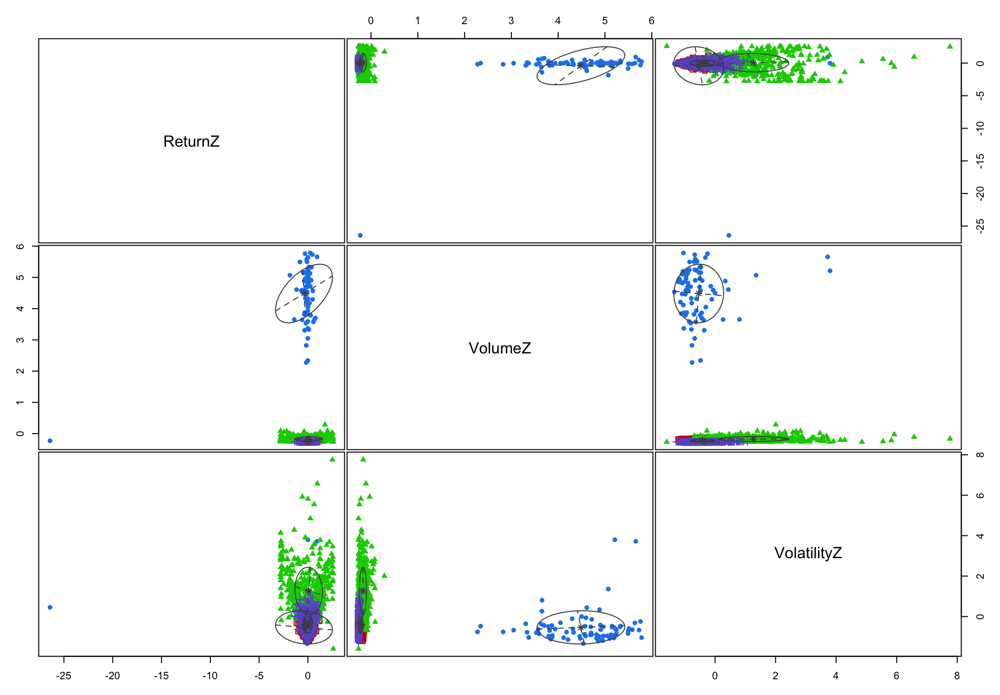
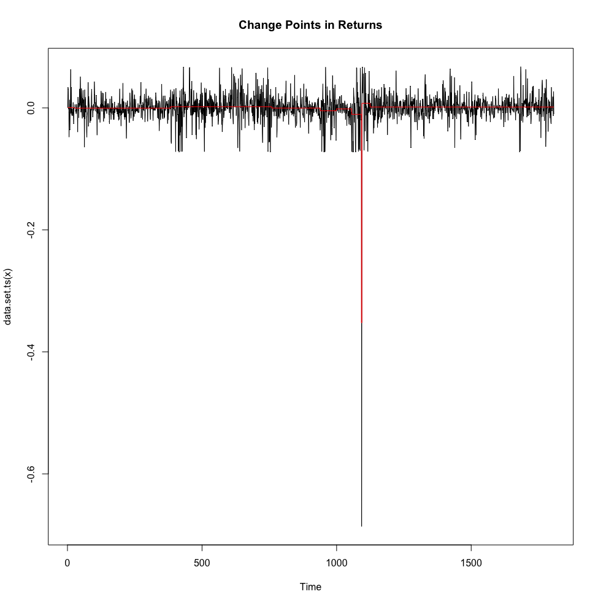
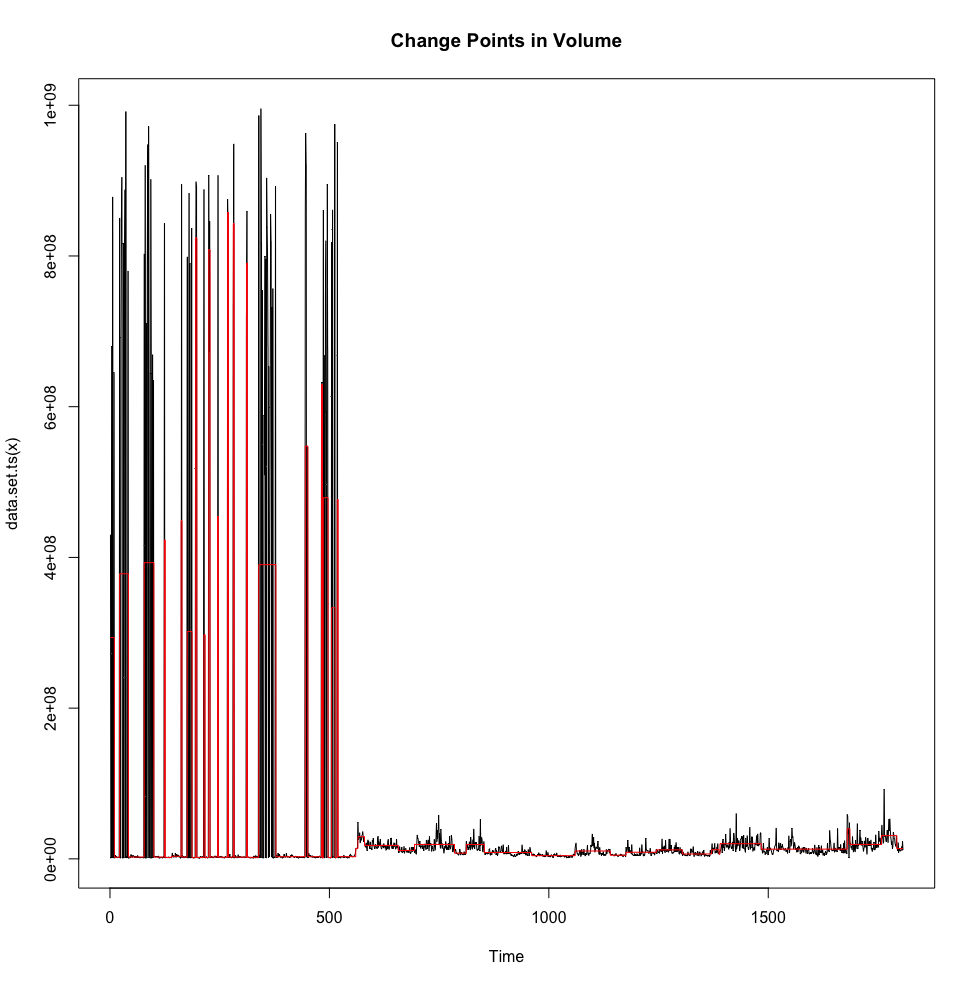
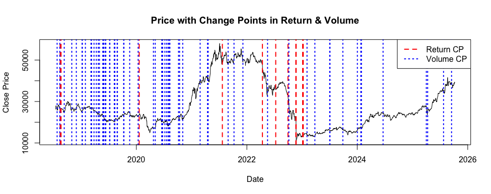

## Step 1: Load and Clean data
```{r}
# Load libraries
library(tidyverse)
library(lubridate)
library(mclust)       # For Gaussian Mixture Models
library(changepoint)  # For regime change detection

# Load your dataset
tcb <- read_csv("TCB_2018_2025.csv")

# Inspect
glimpse(tcb)

# Clean and format
tcb <- tcb %>%
  rename(Date = date,
         Open = open,
         High = high,
         Low  = low,
         Close = close,
         Volume = volume.million.,
         PctChange = percent.change
) %>%
  mutate(
    Date = ymd(Date),
    Volume = as.numeric(gsub(",", "", Volume)),
    Return = log(Close / lag(Close)),
    RelVolume = Volume / zoo::rollmean(Volume, 30, fill = NA, align = "right"),
    Volatility = (High - Low) / Open
  ) %>%
  drop_na()
 
```

## Step 2: Create  indicators that highlight unusual trading patterns

```{r}
tcb <- tcb %>%
  mutate(
    VolumeZ = scale(Volume),
    ReturnZ = scale(Return),
    VolatilityZ = scale(Volatility),
    PriceVolumeRatio = abs(ReturnZ) * VolumeZ
  )
```

## Step 3: Fit Bayesian model to detect latent normal vs maniplated regimes using Gaussian Mixture Models
```{r}
# Use standardized features
X <- tcb %>% select(ReturnZ, VolumeZ, VolatilityZ) %>% na.omit()

# Fit a mixture model (Bayesian information used automatically)
gmm_model <- Mclust(X, G = 1:4)  # Try 1–4 clusters

summary(gmm_model)
plot(gmm_model, what = "classification")

# Add cluster assignments and probabilities
tcb$Cluster <- NA
tcb$Cluster[!is.na(tcb$ReturnZ)] <- gmm_model$classification
tcb$ManipProb <- NA
tcb$ManipProb[!is.na(tcb$ReturnZ)] <- apply(gmm_model$z, 1, max)
```



### Step 4: Find sudden regime shift that might indicate manipulation burst

```{r}
# Detect change points in returns or volume
cp_return <- cpt.meanvar(tcb$Return, method = "PELT")
cp_volume <- cpt.meanvar(tcb$Volume, method = "PELT")

plot(cp_return, main = "Change Points in Returns")
plot(cp_volume, main = "Change Points in Volume")

# Extract change-point indices
cp_return_pts <- cpts(cp_return)
cp_volume_pts <- cpts(cp_volume)
cp_all <- sort(unique(c(cp_return_pts, cp_volume_pts)))
```




### Step 5: Identify suspicious period by combining mixture model & change point output
```{r}
suspicious <- tcb %>%
  filter(ManipProb > 0.8 | Date %in% cpts(cp_volume) | Date %in% cpts(cp_return))

print(suspicious %>% select(Date, Close, Volume, ManipProb))

# Combine change point with clustering
periods <- data.frame(
  start = c(min(tcb$Date), tcb$Date[cp_all]),
  end   = c(tcb$Date[cp_all], max(tcb$Date))
)

periods <- data.frame(
  start = c(min(tcb$Date), tcb$Date[cp_all]),
  end   = c(tcb$Date[cp_all], max(tcb$Date))
)

tcb$Regime <- cut(
  tcb$Date,
  breaks = c(min(tcb$Date), tcb$Date[cp_all], max(tcb$Date)),
  include.lowest = TRUE,
  labels = paste0("R", seq_len(length(cp_all) + 1))
)

regime_summary <- aggregate(Cluster ~ Regime, data = tcb, 
                            FUN = function(x) names(sort(table(x), decreasing = TRUE))[1])


prop_table <- as.data.frame.matrix(
  with(tcb, table(Regime, Cluster))
)
prop_table <- prop_table / rowSums(prop_table)

# combine and interprete
final_summary <- merge(periods, regime_summary, by.x = "row.names", by.y = "Regime")
colnames(final_summary) <- c("Regime", "Start", "End", "DominantCluster")
```

### Step 6: Visualize
```{r}

# Final result
plot(tcb$Date, tcb$Close, type = "l", col = "black",
     main = "Price with Change Points in Return & Volume",
     xlab = "Date", ylab = "Close Price")
abline(v = tcb$Date[cp_return_pts], col = "red", lwd = 2, lty = 2)
abline(v = tcb$Date[cp_volume_pts], col = "blue", lwd = 2, lty = 3)
legend("topright",
       legend = c("Return CP", "Volume CP"),
       col = c("red", "blue"),
       lwd = 2, lty = c(2,3))
```


