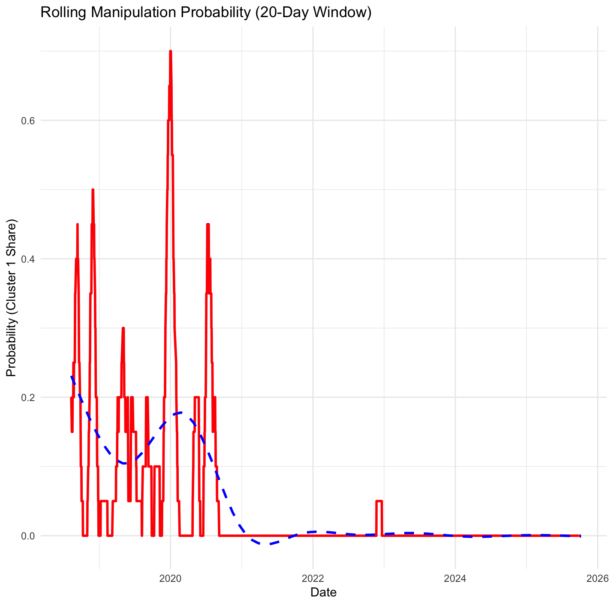

## Step 1: Load and Clean data
```{r}
# Load libraries
library(tidyverse)
library(lubridate)
library(mclust)       # For Gaussian Mixture Models
library(changepoint)  # For regime change detection

# Load your dataset
tcb <- read_csv("TCB_2018_2025.csv")

# Inspect
glimpse(tcb)

# Clean and format
tcb <- tcb %>%
  rename(Date = date,
         Open = open,
         High = high,
         Low  = low,
         Close = close,
         Volume = volume.million.,
         PctChange = percent.change
) %>%
  mutate(
    Date = ymd(Date),
    Volume = as.numeric(gsub(",", "", Volume)),
    Return = log(Close / lag(Close)),
    RelVolume = Volume / zoo::rollmean(Volume, 30, fill = NA, align = "right"),
    Volatility = (High - Low) / Open
  ) %>%
  drop_na()
 
```

## Step 2: Create  indicators that highlight unusual trading patterns

```{r}
tcb <- tcb %>%
  mutate(
    VolumeZ = scale(Volume),
    ReturnZ = scale(Return),
    VolatilityZ = scale(Volatility),
    PriceVolumeRatio = abs(ReturnZ) * VolumeZ
  )
```

## Step 3: Fit Bayesian model to detect latent normal vs maniplated regimes using Gaussian Mixture Models
```{r}
# Use standardized features
X <- tcb %>% select(ReturnZ, VolumeZ, VolatilityZ) %>% na.omit()

# Fit a mixture model (Bayesian information used automatically)
gmm_model <- Mclust(X, G = 1:4)  # Try 1–4 clusters

summary(gmm_model)
plot(gmm_model, what = "classification")

# Add cluster assignments and probabilities
tcb$Cluster <- NA
tcb$Cluster[!is.na(tcb$ReturnZ)] <- gmm_model$classification
tcb$ManipProb <- NA
tcb$ManipProb[!is.na(tcb$ReturnZ)] <- apply(gmm_model$z, 1, max)
```


### Step 4: Find sudden regime shift that might indicate manipulation burst

```{r}
# Detect change points in returns or volume
cp_return <- cpt.meanvar(tcb$Return, method = "PELT")
cp_volume <- cpt.meanvar(tcb$Volume, method = "PELT")

plot(cp_return, main = "Change Points in Returns")
plot(cp_volume, main = "Change Points in Volume")

# Extract change-point indices
cp_return_pts <- cpts(cp_return)
cp_volume_pts <- cpts(cp_volume)
cp_all <- sort(unique(c(cp_return_pts, cp_volume_pts)))
```


### Step 5: Identify suspicious period by combining mixture model & change point output
```{r}
suspicious <- tcb %>%
  filter(ManipProb > 0.8 | Date %in% cpts(cp_volume) | Date %in% cpts(cp_return))

print(suspicious %>% select(Date, Close, Volume, ManipProb))

# Combine change point with clustering
periods <- data.frame(
  start = c(min(tcb$Date), tcb$Date[cp_all]),
  end   = c(tcb$Date[cp_all], max(tcb$Date))
)

periods <- data.frame(
  start = c(min(tcb$Date), tcb$Date[cp_all]),
  end   = c(tcb$Date[cp_all], max(tcb$Date))
)

tcb$Regime <- cut(
  tcb$Date,
  breaks = c(min(tcb$Date), tcb$Date[cp_all], max(tcb$Date)),
  include.lowest = TRUE,
  labels = paste0("R", seq_len(length(cp_all) + 1))
)

regime_summary <- aggregate(Cluster ~ Regime, data = tcb, 
                            FUN = function(x) names(sort(table(x), decreasing = TRUE))[1])


prop_table <- as.data.frame.matrix(
  with(tcb, table(Regime, Cluster))
)
prop_table <- prop_table / rowSums(prop_table)

# combine and interprete
final_summary <- merge(periods, regime_summary, by.x = "row.names", by.y = "Regime")
colnames(final_summary) <- c("Regime", "Start", "End", "DominantCluster")
```

### Step 6: Visualize
```{r}

# Final result
plot(tcb$Date, tcb$Close, type = "l", col = "black",
     main = "Price with Change Points in Return & Volume",
     xlab = "Date", ylab = "Close Price")
abline(v = tcb$Date[cp_return_pts], col = "red", lwd = 2, lty = 2)
abline(v = tcb$Date[cp_volume_pts], col = "blue", lwd = 2, lty = 3)
legend("topright",
       legend = c("Return CP", "Volume CP"),
       col = c("red", "blue"),
       lwd = 2, lty = c(2,3))
```


### Step 7: Pinpoint Cluster 1 regime, indentify and confirm manipulation behaviors

```{r}
# Create a timeline regime for tcb:
tcb$Regime <- cut(tcb$Date,
                  breaks = c(min(tcb$Date), sort(tcb$Date[cp_all]), max(tcb$Date)),
                  include.lowest = TRUE,
                  labels = paste0("R", seq_along(cp_all) + 1))

# Create the cluster-regime table
library(dplyr)

cluster_by_regime <- tcb %>%
  filter(!is.na(Regime), !is.na(Cluster)) %>%
  group_by(Regime, Cluster) %>%
  summarise(Count = n(), .groups = 'drop') %>%
  group_by(Regime) %>%
  mutate(Share = Count / sum(Count)) %>%
  ungroup()
# Identify regimes dominated by the suspicious cluster(1)
manip_regimes <- cluster_by_regime %>%
  filter(Cluster == 1) %>%
  arrange(desc(Share)) %>%
  head(10)

manip_regimes

# Attach date ranges to those regimes
# Get regime boundaries
regime_boundaries <- data.frame(
  Regime = levels(tcb$Regime),
  Start = as.Date(c(min(tcb$Date), sort(tcb$Date[cp_all]))),
  End = as.Date(c(sort(tcb$Date[cp_all]), max(tcb$Date)))
)

# Join to manipulative regimes
manip_periods <- left_join(manip_regimes, regime_boundaries, by = "Regime")
manip_periods


# Result
manip_periods

```
| **Regime**  | **Date Range**          | **Dominant Cluster** | **Share** | **Interpretation**                                                  |
| ----------- | ----------------------- | -------------------- | --------- | ------------------------------------------------------------------- |
| **R16**     | 2019-04-24 → 2019-05-02 | 1                    | 0.67      | High-volume selloff — possible insider exit or distribution phase   |
| **R21**     | 2019-06-10 → 2019-06-13 | 1                    | 0.67      | Short manipulation window — maybe pre-earnings positioning          |
| **R38**     | 2020-06-23 → 2020-07-08 | 1                    | 0.55      | Volume surge after COVID-crash recovery — possible speculative wave |
| **R3–R4**   | 2018-08-13 → 2018-08-21 | 1                    | 0.50      | Initial manipulation-like burst during early observation window     |
| **R9**      | 2019-01-07 → 2019-01-09 | 1                    | 0.50      | Short-term volume distortion — may be year-start repositioning      |
| **R25–R29** | 2019-08-08 → 2019-10-11 | 1                    | 0.50      | Sequence of small suspicious windows over ~2 months                 |
| **R34**     | 2020-04-23 → 2020-05-05 | 1                    | 0.50      | Early-pandemic volatility — heavy trades, price pressure            |


### Step 8: Compute an overall "Manipu;lation Probability" time series
```{r}
library(dplyr)
library(zoo)

# Set rolling window size (in trading days)
window_size <- 20  

tcb <- tcb %>%
  arrange(Date) %>%
  mutate(
    ManipProb = rollapply(
      data = (Cluster == 1) * 1,  # 1 if Cluster 1, else 0
      width = window_size,
      FUN = mean,
      align = "right",
      fill = NA
    )
  )

library(ggplot2)

ggplot(tcb, aes(x = Date, y = ManipProb)) +
  geom_line(color = "red", size = 1) +
  geom_smooth(span = 0.1, se = FALSE, color = "black", linetype = "dashed") +
  labs(
    title = "Rolling Manipulation Probability (Cluster 1 Share Over Time)",
    subtitle = paste0("Window size: ", window_size, " trading days"),
    x = "Date",
    y = "Manipulation Probability"
  ) +
  theme_minimal(base_size = 13)

threshold <- 0.6

ggplot(tcb, aes(x = Date, y = ManipProb)) +
  geom_line(color = "red") +
  geom_hline(yintercept = threshold, linetype = "dashed", color = "black") +
  geom_ribbon(
    aes(ymin = 0, ymax = ifelse(ManipProb > threshold, ManipProb, NA)),
    fill = "red", alpha = 0.2
  ) +
  labs(
    title = "Manipulation Probability Zones",
    subtitle = paste0("Highlighted when ManipProb > ", threshold),
    y = "Manipulation Probability",
    x = "Date"
  ) +
  theme_minimal(base_size = 13)

library(dplyr)
library(zoo)
library(ggplot2)

# --- Step 1: Ensure date is in Date format ---
tcb <- tcb %>%
  mutate(Date = as.Date(Date)) %>%
  arrange(Date)

# --- Step 2: Compute rolling Cluster 1 share ---
# For example, use a 20-day rolling window
window_size <- 20

rolling_prob <- tcb %>%
  mutate(IsManip = ifelse(Cluster == 1, 1, 0)) %>%
  mutate(ManipProb = rollapply(IsManip, width = window_size, FUN = mean, align = "right", fill = NA)) %>%
  select(Date, ManipProb)

# --- Step 3: Plot the rolling manipulation probability ---
ggplot(rolling_prob, aes(x = Date, y = ManipProb)) +
  geom_line(color = "red", size = 1) +
  geom_smooth(se = FALSE, color = "blue", linetype = "dashed") +
  labs(
    title = paste("Rolling Manipulation Probability (", window_size, "-Day Window)", sep=""),
    y = "Probability (Cluster 1 Share)",
    x = "Date"
  ) +
  theme_minimal()
```


### Step 9: prediction for the next manipulation
```{r}
# install.packages("depmixS4")
library(depmixS4)
library(dplyr)

# Prepare observation matrix (use standardized features)
obs <- tcb %>% arrange(Date) %>% select(ReturnZ, VolumeZ, VolatilityZ) %>% na.omit()

# Fit HMM with 3 states (adjust #states if needed)
post <- posterior(fm)   # contains 'state'
tcb_states <- cbind(tcb, state = post$state)
n_states <- 3
mod <- depmix(response = list(ReturnZ ~ 1, VolumeZ ~ 1, VolatilityZ ~ 1),
              data = obs,
              nstates = n_states,
              family = list(gaussian(), gaussian(), gaussian()))
set.seed(123)
fm <- fit(mod)

# Get most likely state for each day (Viterbi)
viterbi_states <- posterior(fm)$state

# Map HMM state number -> your cluster labels (match by means)
state_means <- posterior(fm) %>%
  group_by(state) %>%
  summarise(meanR = mean(ReturnZ), meanV = mean(VolumeZ), meanVol = mean(VolatilityZ))

print(state_means)
# Decide which HMM state corresponds to 'manipulative' (highest meanV or pattern akin to Cluster1)
resp_models <- fm@response

state_means <- matrix(0, n_states, 3)
state_sds   <- matrix(0, n_states, 3)

for(s in 1:n_states){
  for(j in 1:3){
    pars <- resp_models[[s]][[j]]@parameters
    
    # Mean = first element of coefficients
    state_means[s, j] <- pars$coefficients[1]
    
    # SD
    state_sds[s, j]   <- pars$sd
  }
}

colnames(state_means) <- c("ReturnZ", "VolumeZ", "VolatilityZ")
colnames(state_sds)   <- c("ReturnZ", "VolumeZ", "VolatilityZ")

state_means
state_sds
# Monte Carlo forward simulation from last observed state
set.seed(123)

Nsim <- 5000
horizon <- 20   # days ahead

# Last observed hidden state
start_state <- tail(viterbi_states, 1)

# Transition matrix
trans <- matrix(getpars(fm)[(n_states+1):(n_states + n_states^2)], 
                nrow = n_states, byrow = TRUE)

# For storing simulation results
sim_states <- matrix(0, nrow=Nsim, ncol=horizon)

for(sim in 1:Nsim){
    s <- start_state
    for(t in 1:horizon){
        # draw next state from multinomial
        s <- sample(1:n_states, size=1, prob = trans[s, ])
        sim_states[sim, t] <- s
    }
}

# Probability of manipulation on each future day
manip_prob <- colMeans(sim_states == 2)   # state 2 = manipulation
manip_prob
```


