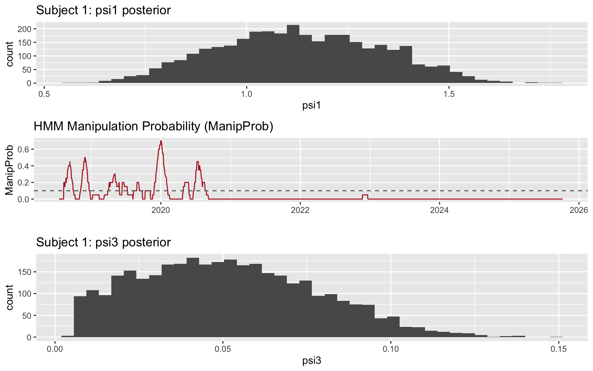

### Test for Wash trading
```{r}
# --- Libraries ---
library(dplyr)
library(zoo)
library(ggplot2)
library(scales)   # for percent_format
library(gridExtra)

# --- 1) Compute a robust Wash Trading Score (WTS) ---
# Idea: high volume with low absolute return and low volatility -> wash-like
# Use winsorized / robust components to limit influence of extreme outliers

winsorize <- function(x, p = 0.01){
  q <- quantile(x, probs = c(p, 1-p), na.rm = TRUE)
  pmax(pmin(x, q[2]), q[1])
}

tcb <- tcb %>%
  arrange(Date) %>%
  mutate(
    # ensure z-scores exist; if not create them
    ReturnZ = ifelse(is.na(ReturnZ), scale(Return), ReturnZ),
    VolumeZ = ifelse(is.na(VolumeZ), scale(Volume), VolumeZ),
    VolatilityZ = ifelse(is.na(VolatilityZ), scale(Volatility), VolatilityZ),

    # winsorize raw z-scores to reduce single-day noise
    ReturnZ_w = as.numeric(scale(winsorize(ReturnZ, p = 0.01))),
    VolumeZ_w = as.numeric(scale(winsorize(VolumeZ, p = 0.01))),
    VolatilityZ_w = as.numeric(scale(winsorize(VolatilityZ, p = 0.01)))
  )

# Compute raw Wash Trading Score:
# High VolumeZ_w combined with very small |ReturnZ_w| and small VolatilityZ_w -> high wash score.
# Use denominator to downweight days with non-trivial price movement / volatility
tcb <- tcb %>%
  mutate(
    WTS_raw = VolumeZ_w / (1 + abs(ReturnZ_w) + pmax(0, VolatilityZ_w)),
    # If volZ is negative (low volatility) pmax gives 0 which increases WTS appropriately.
    # For interpretability, replace Inf/NAs
    WTS_raw = ifelse(is.finite(WTS_raw), WTS_raw, NA_real_)
  )

# --- 2) Smooth / normalize WTS into probability-like WashProb ---
# Use rolling median or exponentially weighted smoothing then map to [0,1] by robust scaling.
window <- 20  # days to smooth over; adjust as needed
tcb <- tcb %>%
  mutate(
    WTS_smooth = zoo::rollapply(WTS_raw, width = window, FUN = median, fill = NA, align = "right"),
    # robust min-max: map 1st-99th percentiles to [0,1]
    p1 = quantile(WTS_smooth, probs = 0.01, na.rm = TRUE),
    p99= quantile(WTS_smooth, probs = 0.99, na.rm = TRUE),
    WashProb = (WTS_smooth - p1) / (p99 - p1),
    WashProb = pmin(pmax(WashProb, 0), 1)   # clamp to [0,1]
  ) %>%
  select(-p1, -p99)

# --- 3) Combine with ManipProb into Unified Manipulation Index (UMI) ---
# Normalize ManipProb to [0,1] if not already
tcb <- tcb %>%
  mutate(
    ManipProb = ifelse(is.na(ManipProb), 0, ManipProb),  # ensure no NA
    # If ManipProb is a rolling share already in 0-1 scale, keep it; else scale similarly.
    # We'll combine with weights:
    w_manip = 0.6,    # weight for HMM/manip detection (adjustable)
    w_wash  = 0.4,    # weight for wash detection
    UMI_raw = w_manip * ManipProb + w_wash * WashProb
  ) %>%
  mutate(
    # optionally scale UMI to 0-100 index
    UMI = round(UMI_raw * 100, 1)
  )

# --- 4) Flagging rules / trading signals derived from UMI ---
# Example rule:
# UMI >= 60 => strong alert (reduce exposure / close longs)
# UMI 30-60 => watch / tighten stops
# UMI <30 => normal
tcb <- tcb %>%
  mutate(
    RiskLevel = cut(UMI, breaks = c(-Inf, 30, 60, Inf), labels = c("Low","Medium","High")),
    Signal = case_when(
      UMI >= 60 ~ "SELL / REDUCE",
      UMI >= 30 ~ "WATCH / HEDGE",
      TRUE      ~ "NORMAL"
    )
  )

# --- 5) Plotting dashboard: (A) WashProb, (B) ManipProb, (C) UMI with shaded regions ---
p1 <- ggplot(tcb, aes(Date, WashProb)) +
  geom_line(color = "steelblue") +
  geom_hline(yintercept = 0.5, linetype = "dashed", color = "grey40") +
  labs(title = "Wash Trading Probability (smoothed)", y = "WashProb", x = "")

p2 <- ggplot(tcb, aes(Date, ManipProb)) +
  geom_line(color = "firebrick") +
  geom_hline(yintercept = 0.1, linetype = "dashed", color = "grey40") +
  labs(title = "HMM Manipulation Probability (ManipProb)", y = "ManipProb", x = "")

p3 <- ggplot(tcb, aes(Date, UMI)) +
  geom_line(color = "darkgreen", size = 1) +
  geom_ribbon(data = subset(tcb, UMI >= 60), aes(ymin = 0, ymax = UMI), fill = "red", alpha = 0.15, inherit.aes = TRUE) +
  geom_hline(yintercept = c(30,60), linetype = "dashed", color = "grey40") +
  labs(title = "Unified Manipulation Index (UMI, 0-100)", y = "UMI", x = "Date")

# Combine plots vertically
gridExtra::grid.arrange(p1, p2, p3, ncol = 1, heights = c(1,1,1.2))

# --- 6) Producing the alert table to review suspicious windows ---
# Extract windows where UMI high
alerts <- tcb %>%
  filter(UMI >= 60) %>%
  select(Date, Close, Volume, Return, WashProb, ManipProb, UMI, RiskLevel, Signal)

# Group into contiguous alert periods (gap tolerance e.g. 3 trading days)
if(nrow(alerts) > 0){
  alerts_periods <- alerts %>%
    mutate(g = cumsum(c(1, diff(as.integer(Date)) > 3))) %>%
    group_by(g) %>%
    summarise(
      Start = min(Date),
      End   = max(Date),
      Days  = n(),
      MeanUMI = mean(UMI),
      MaxWashProb = max(WashProb, na.rm=TRUE),
      MaxManipProb = max(ManipProb, na.rm=TRUE)
    ) %>%
    arrange(desc(MeanUMI))
} else {
  alerts_periods <- data.frame()
}

# Print a shortlist
print(head(alerts_periods, 20))
# Save tables for reporting
write.csv(tcb, "tcb_with_wash_and_umi.csv", row.names = FALSE)
write.csv(alerts_periods, "suspicious_periods.csv", row.names = FALSE)

# --- 7) Per-regime average (optional) to compare with earlier regimes ---
if("Regime" %in% names(tcb)){
  regime_summary <- tcb %>%
    group_by(Regime) %>%
    summarise(
      Start = min(Date),
      End = max(Date),
      AvgWashProb = mean(WashProb, na.rm=TRUE),
      AvgManipProb = mean(ManipProb, na.rm=TRUE),
      AvgUMI = mean(UMI, na.rm=TRUE)
    ) %>%
    arrange(desc(AvgUMI))
  print(head(regime_summary, 30))
}
```

