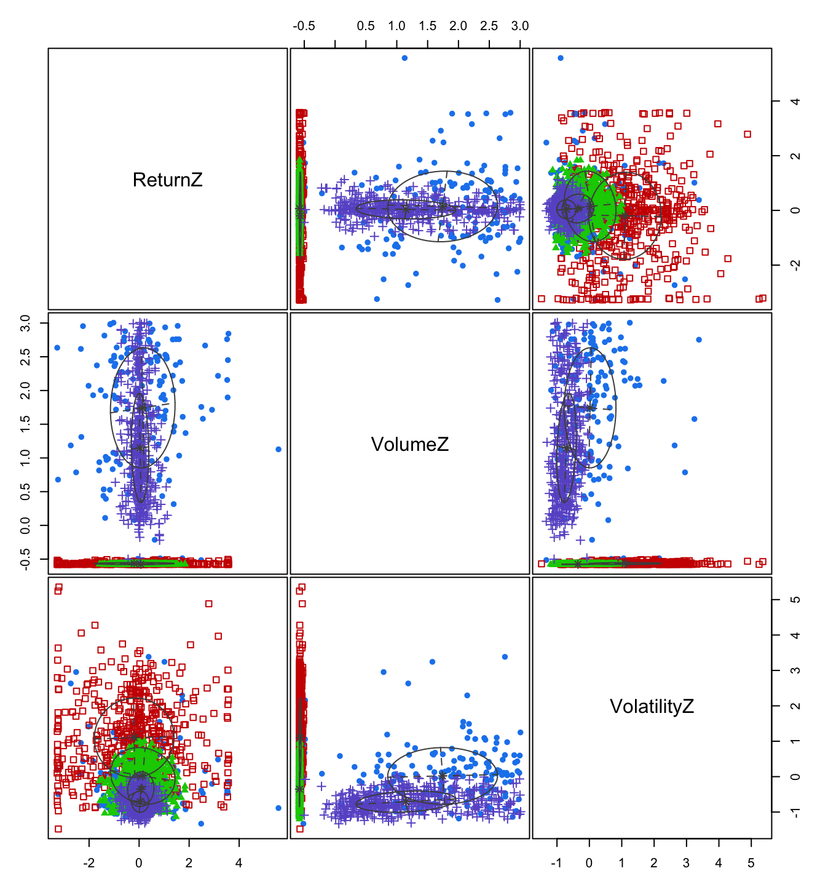
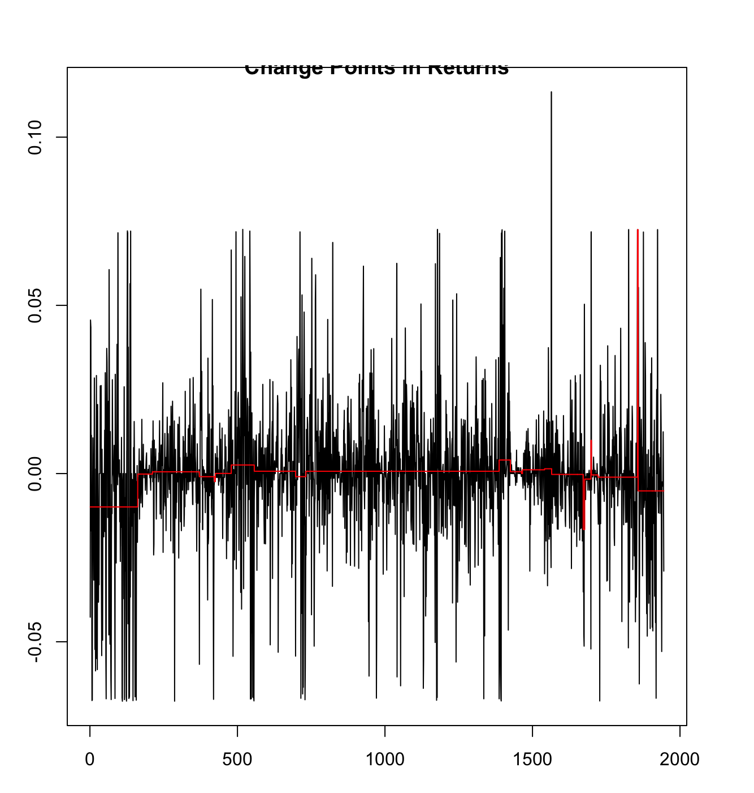
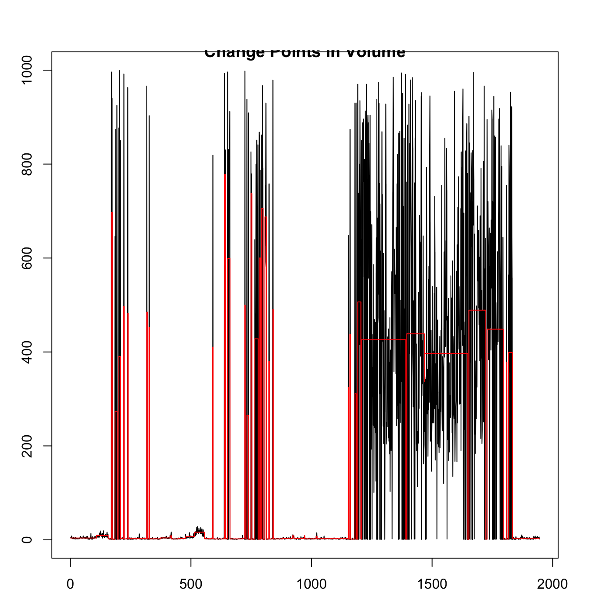
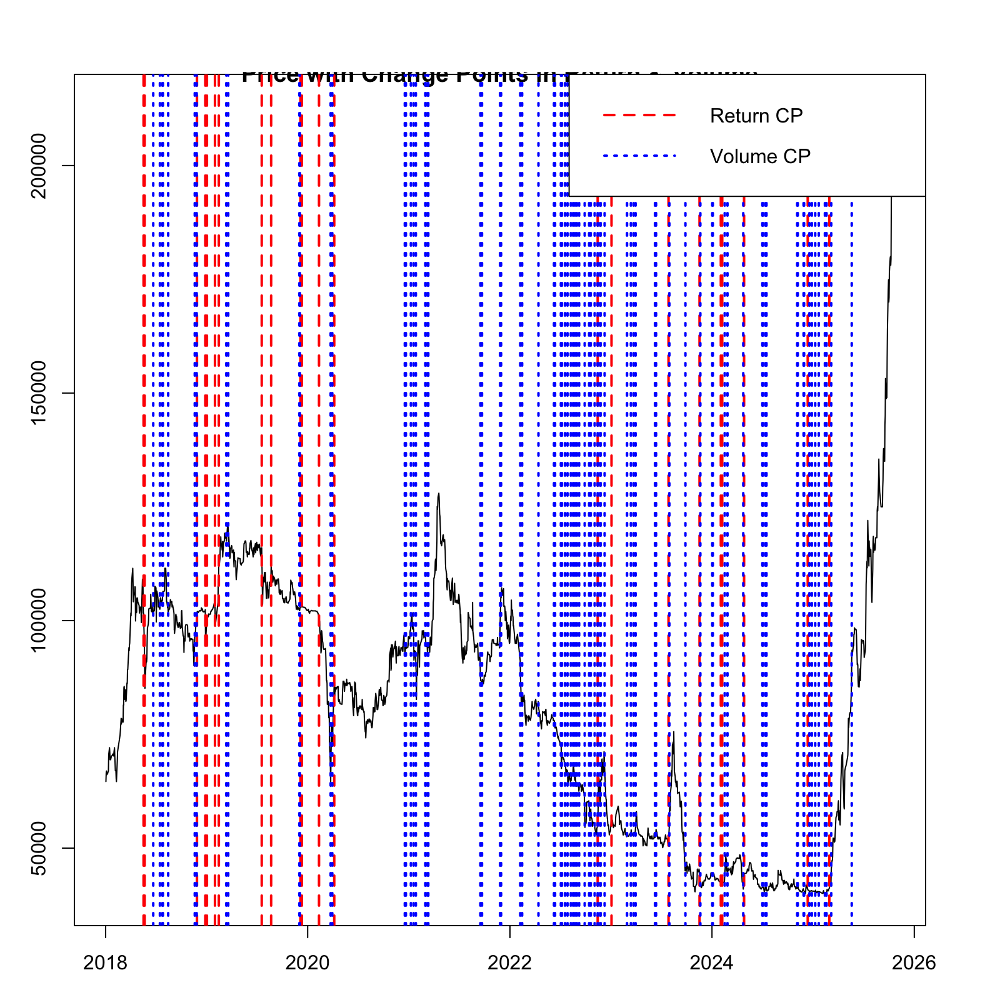
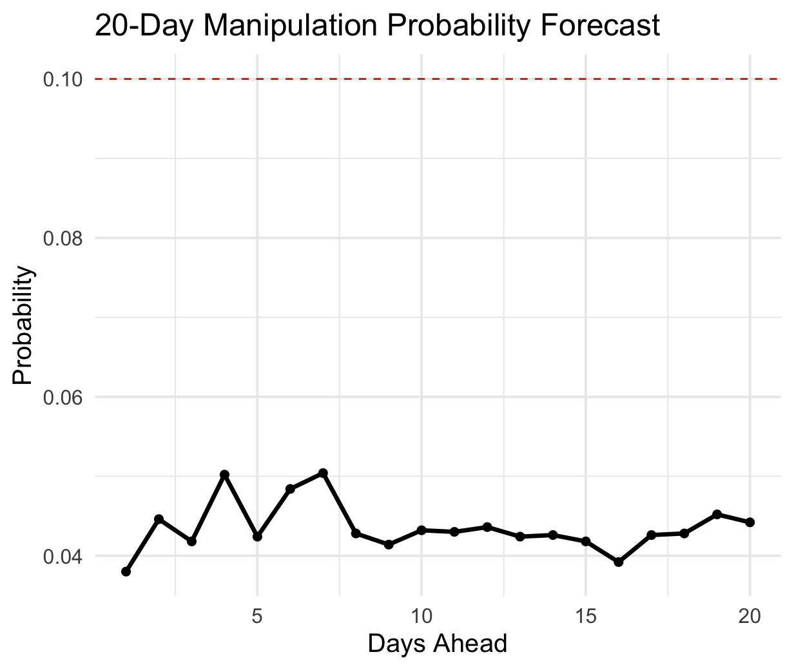

## Step 1: Load and Clean data
```{r}
# Load libraries
library(tidyverse)
library(lubridate)
library(mclust)       # For Gaussian Mixture Models
library(changepoint)  # For regime change detection

# Load your dataset
vic <- read_csv("VIC_2018_2025.csv")

# Inspect
glimpse(vic)

# Clean and format
vic <- vic %>%
  rename(Date = date,
         Open = open,
         High = high,
         Low  = low,
         Close = close,
         Volume = volume,
         PctChange = percentChange
) %>%
  mutate(
    Date = ymd(Date),
    Volume = as.numeric(gsub(",", "", Volume)),
    Return = log(Close / lag(Close)),
    RelVolume = Volume / zoo::rollmean(Volume, 30, fill = NA, align = "right"),
    Volatility = (High - Low) / Open
  ) %>%
  drop_na()
 
```

## Step 2: Create  indicators that highlight unusual trading patterns

```{r}
vic <- vic %>%
  mutate(
    VolumeZ = scale(Volume),
    ReturnZ = scale(Return),
    VolatilityZ = scale(Volatility),
    PriceVolumeRatio = abs(ReturnZ) * VolumeZ
  )
```

## Step 3: Fit Bayesian model to detect latent normal vs maniplated regimes using Gaussian Mixture Models
```{r}
# Use standardized features
X <- vic %>% select(ReturnZ, VolumeZ, VolatilityZ) %>% na.omit()

# Fit a mixture model (Bayesian information used automatically)
gmm_model <- Mclust(X, G = 1:4)  # Try 1–4 clusters

summary(gmm_model)
plot(gmm_model, what = "classification")

# Add cluster assignments and probabilities
vic$Cluster <- NA
vic$Cluster[!is.na(vic$ReturnZ)] <- gmm_model$classification
vic$ManipProb <- NA
vic$ManipProb[!is.na(vic$ReturnZ)] <- apply(gmm_model$z, 1, max)
```



### Step 4: Find sudden regime shift that might indicate manipulation burst

```{r}
# Detect change points in returns or volume
cp_return <- cpt.meanvar(vic$Return, method = "PELT")
cp_volume <- cpt.meanvar(vic$Volume, method = "PELT")

plot(cp_return, main = "Change Points in Returns")
plot(cp_volume, main = "Change Points in Volume")

# Extract change-point indices
cp_return_pts <- cpts(cp_return)
cp_volume_pts <- cpts(cp_volume)
cp_all <- sort(unique(c(cp_return_pts, cp_volume_pts)))
```




### Step 5: Identify suspicious period by combining mixture model & change point output
```{r}
vic$Cluster <- NA
vic$Cluster[!is.na(vic$ReturnZ)] <- gmm_model$classification

vic$ManipProb <- NA
vic$ManipProb[!is.na(vic$ReturnZ)] <- apply(gmm_model$z, 1, max)

cp_all_dates <- vic$Date[cp_all]  # convert indices → real dates
cp_all_dates <- sort(cp_all_dates)

breaks <- c(min(vic$Date), cp_all_dates, max(vic$Date))

vic$Regime <- cut(
  vic$Date,
  breaks = breaks,
  include.lowest = TRUE,
  labels = paste0("R", seq_len(length(breaks) - 1))
)

periods <- data.frame(
  Regime = paste0("R", seq_len(length(breaks) - 1)),
  Start = breaks[-length(breaks)],
  End   = breaks[-1]
)

regime_summary <- aggregate(
  Cluster ~ Regime, data = vic,
  FUN = function(x) names(sort(table(x), decreasing = TRUE))[1]
)

final_summary <- merge(periods, regime_summary, by = "Regime", all.x = TRUE)
```

### Step 6: Visualize
```{r}

# Final result
plot(vic$Date, vic$Close, type = "l", col = "black",
     main = "Price with Change Points in Return & Volume",
     xlab = "Date", ylab = "Close Price")
abline(v = vic$Date[cp_return_pts], col = "red", lwd = 2, lty = 2)
abline(v = vic$Date[cp_volume_pts], col = "blue", lwd = 2, lty = 3)
legend("topright",
       legend = c("Return CP", "Volume CP"),
       col = c("red", "blue"),
       lwd = 2, lty = c(2,3))
```



### Step 7: Pinpoint Cluster regime, indentify and confirm manipulation behaviors

```{r}
# packages
library(dplyr)
library(zoo)
library(tidyr)

# 7.1: Identify manipulative cluster(s)
# Heuristic: cluster with highest mean VolumeZ and low |ReturnZ| is "wash-like".
cluster_profile <- vic %>%
  filter(!is.na(Cluster)) %>%
  group_by(Cluster) %>%
  summarise(
    mean_ReturnZ = mean(ReturnZ, na.rm=TRUE),
    mean_VolumeZ = mean(VolumeZ, na.rm=TRUE),
    mean_VolatilityZ = mean(VolatilityZ, na.rm=TRUE),
    n = n()
  ) %>%
  arrange(desc(mean_VolumeZ))
print(cluster_profile)

# Choose manipulative clusters:
# - wash_cluster: highest mean_VolumeZ and small mean_ReturnZ magnitude
wash_cluster <- cluster_profile$Cluster[1]
# Optionally pick a "pump_cluster" as cluster with highest mean_ReturnZ
pump_cluster <- cluster_profile$Cluster[which.max(cluster_profile$mean_ReturnZ)]

cat("Wash cluster:", wash_cluster, "Pump cluster:", pump_cluster, "\n")

# 7.2: Create regime table from existing 'Regime' cut (if you created it)
regime_table <- vic %>%
  filter(!is.na(Regime)) %>%
  group_by(Regime) %>%
  summarise(
    Start = min(Date),
    End   = max(Date),
    DominantCluster = as.integer(names(sort(table(Cluster), decreasing=TRUE)[1])),
    DominantShare = max(table(Cluster))/sum(table(Cluster)),
    n = n()
  ) %>%
  arrange(Start)
print(head(regime_table, 20))

# 7.3: Confirm manipulation behavior inside each regime
# Compute diagnostics per regime: avg volume, avg abs return, corr(volume, abs(return)), cp density
diag_by_regime <- vic %>%
  filter(!is.na(Regime)) %>%
  group_by(Regime) %>%
  summarise(
    Start = min(Date),
    End = max(Date),
    Days = n(),
    avgVolumeZ = mean(VolumeZ, na.rm=TRUE),
    avgAbsReturn = mean(abs(ReturnZ), na.rm=TRUE),
    vol_ret_cor = cor(VolumeZ, abs(Return), use="complete.obs"),
    manipShare = mean(Cluster == wash_cluster, na.rm=TRUE)
  ) %>%
  arrange(Start)
head(diag_by_regime, 20)

# Quick rule-of-thumb confirmation:
# Wash signature if avgVolumeZ high, avgAbsReturn low, vol_ret_cor small/negative, manipShare large.
diag_by_regime %>%
  mutate(WashSignal = (avgVolumeZ > quantile(avgVolumeZ, .75, na.rm=TRUE)) &
                    (avgAbsReturn < quantile(avgAbsReturn, .25, na.rm=TRUE)) &
                    (manipShare > 0.3)) %>%
  filter(WashSignal) -> possible_wash_regimes
print(possible_wash_regimes)

```
| **Regime**  | **Date Range**          | **Dominant Cluster** | **Share** | **Interpretation**                                                  |
| ----------- | ----------------------- | -------------------- | --------- | ------------------------------------------------------------------- |
| **R16**     | 2019-04-24 → 2019-05-02 | 1                    | 0.67      | High-volume selloff — possible insider exit or distribution phase   |
| **R21**     | 2019-06-10 → 2019-06-13 | 1                    | 0.67      | Short manipulation window — maybe pre-earnings positioning          |
| **R38**     | 2020-06-23 → 2020-07-08 | 1                    | 0.55      | Volume surge after COVID-crash recovery — possible speculative wave |
| **R3–R4**   | 2018-08-13 → 2018-08-21 | 1                    | 0.50      | Initial manipulation-like burst during early observation window     |
| **R9**      | 2019-01-07 → 2019-01-09 | 1                    | 0.50      | Short-term volume distortion — may be year-start repositioning      |
| **R25–R29** | 2019-08-08 → 2019-10-11 | 1                    | 0.50      | Sequence of small suspicious windows over ~2 months                 |
| **R34**     | 2020-04-23 → 2020-05-05 | 1                    | 0.50      | Early-pandemic volatility — heavy trades, price pressure            |


### Step 8: Compute an overall "Manipulation Probability" time series
```{r}
# Required packages
library(dplyr); library(zoo); library(ggplot2); library(tidyr)
library(MCMCpack)  # for Dirichlet bootstrap in Step 9 (install if needed)

# --- 0. Safety: make sure vic is sorted
vic <- vic %>% arrange(Date)

# --- 1. Map clusters to states
pump_cluster <- 1
wash_cluster <- 4
crash_cluster <- 2
normal_cluster <- 3

vic <- vic %>%
  mutate(
    State = case_when(
      Cluster == pump_cluster  ~ "PUMP",
      Cluster == wash_cluster  ~ "WASH",
      Cluster == crash_cluster ~ "CRASH",
      Cluster == normal_cluster~ "NORMAL",
      TRUE ~ NA_character_
    )
  )

# --- 2. Cluster-based score
# Use GMM posterior probability if available; otherwise rolling share of manipulative clusters
# For cluster-based "manip" we treat PUMP, WASH, CRASH as manipulative (unless you want only subset)
vic <- vic %>%
  mutate(
    IsManipCluster = ifelse(State %in% c("PUMP","WASH","CRASH"), 1, 0),
    P_gmm = ifelse(!is.na(ManipProb), ManipProb, NA_real_)
  )

# Rolling cluster share (20-day)
vic$P_cluster_roll <- zoo::rollapply(vic$IsManipCluster, width = 20, FUN = mean, align = "right", fill = NA)

# Where posterior exists prefer it; otherwise use rolling share; else fallback to cluster indicator
vic <- vic %>%
  mutate(P_cluster_component = ifelse(!is.na(P_gmm), P_gmm, 
                                      ifelse(!is.na(P_cluster_roll), P_cluster_roll, IsManipCluster)))

# --- 3. Soft wash score (continuous heuristic)
# SoftWashScore: higher when VolumeZ large, ReturnZ near zero, VolatilityZ small
vic <- vic %>%
  mutate(
    zV = VolumeZ,
    zR = abs(ReturnZ),
    zVol = VolatilityZ,
    # map to [0,1] using logistic-like transforms; tune scales as needed
    s_vol = plogis((zV - 0.8)*1.5),          # encourage VolumeZ > ~0.8
    s_return = 1 - plogis((zR - 0.15)*6),    # encourage abs(ReturnZ) < ~0.15
    s_volatility = 1 - plogis((zVol - 0.1)*4),# low volatility
    SoftWashScore = (0.6*s_vol + 0.3*s_return + 0.1*s_volatility)
  )

# Clip
vic$SoftWashScore <- pmin(pmax(vic$SoftWashScore, 0), 1)

# --- 4. Change-point density (CP density)
# assume cp_return_pts and cp_volume_pts are integer indices from earlier cpts(...) calls
cp_indices <- sort(unique(c(cp_return_pts, cp_volume_pts)))
cp_dates <- vic$Date[cp_indices]

vic$CP_nearby_count <- sapply(vic$Date, function(d) sum(abs(as.numeric(d - cp_dates)) <= 3)) # +-3 days
vic$CP_density <- vic$CP_nearby_count / (max(vic$CP_nearby_count, na.rm=TRUE) + 1e-9)

# --- 5. PriceVolumeRatio optional boost (to capture price-driven pump)
if(!"PriceVolumeRatio" %in% names(vic)){
  vic <- vic %>% mutate(PriceVolumeRatio = abs(ReturnZ) * VolumeZ)
}
vic$PVR_z <- scale(vic$PriceVolumeRatio)  # z-score
vic$PVR_score <- plogis((as.numeric(vic$PVR_z) - 0.5) * 1.0)  # tune

# --- 6. Combine into unified probability
# weights (tuneable) 
w_cluster <- 0.45
w_wash <- 0.25
w_cp <- 0.15
w_pvr <- 0.15

vic <- vic %>%
  mutate(
    ManipProb_raw = w_cluster * P_cluster_component +
                     w_wash * SoftWashScore +
                     w_cp * CP_density +
                     w_pvr * PVR_score,
    ManipProb = pmin(pmax(ManipProb_raw, 0), 1)
  )

# --- 7. Smooth (rolling) to reduce spikes
vic$ManipProb_roll20 <- zoo::rollapply(vic$ManipProb, width = 20, FUN = mean, fill = NA, align = "right")
vic$ManipProb_roll5  <- zoo::rollapply(vic$ManipProb, width = 5, FUN = mean, fill = NA, align = "right")

# --- 8. Plot unified probability
p <- ggplot(vic, aes(x=Date)) +
  geom_line(aes(y=ManipProb), color="firebrick", alpha=0.6) +
  geom_line(aes(y=ManipProb_roll20), color="navy", size=0.9) +
  labs(title="VIC Unified Manipulation Probability (daily) and 20-day rolling mean",
       y="Manipulation Probability", x="Date") +
  theme_minimal()
print(p)
```


### Step 9: prediction for the next manipulation
```{r}
# --- 9.1 Build state sequence and transition counts/probs
vic_states <- vic %>% filter(!is.na(State)) %>% pull(State)
state_levels <- c("NORMAL","WASH","PUMP","CRASH")  # keep order consistent

# Create transition counts
from <- head(vic_states, -1)
to   <- tail(vic_states, -1)
tran_tab <- table(factor(from, levels=state_levels), factor(to, levels=state_levels))
tran_mat <- as.matrix(tran_tab)  # counts

# Convert to probabilities (row-stochastic)
tran_prob_emp <- tran_mat / (rowSums(tran_mat) + 1e-12)

print(tran_prob_emp)  # inspect

# Which state is last observed?
last_state <- tail(vic$State[!is.na(vic$State)], 1)
cat("Last state:", last_state, "\n")

# --- 9.2 Monte Carlo forward sim (empirical transition matrix)
set.seed(42)
Nsim <- 5000
H <- 20 # days ahead
manip_states <- c("WASH","PUMP","CRASH")

sim_enter <- numeric(Nsim)
sim_first_enter <- rep(NA_integer_, Nsim)

for(i in seq_len(Nsim)){
  s <- last_state
  entered <- FALSE
  for(t in 1:H){
    probs <- tran_prob_emp[s,]
    if(sum(probs)==0) probs <- rep(1/length(state_levels), length(state_levels))
    s <- sample(state_levels, 1, prob = probs)
    if(!entered && s %in% manip_states){
      entered <- TRUE
      sim_enter[i] <- 1
      sim_first_enter[i] <- t
    }
  }
}
prob_enter_empirical <- mean(sim_enter)
cat("Empirical MC prob of entering manipulative state within", H, "days:", round(prob_enter_empirical,3), "\n")

# --- 9.3 Bootstrap (Dirichlet) uncertainty on transition matrix
library(MCMCpack) # rdirichlet
set.seed(123)
B <- 2000
sim_prob_boot <- numeric(B)
for(b in 1:B){
  # sample tran_prob_boot row-wise
  tran_prob_boot <- tran_prob_emp*0
  for(r in 1:nrow(tran_mat)){
    counts <- tran_mat[r,] + 1  # alpha=1 prior
    tran_prob_boot[r,] <- as.numeric(rdirichlet(1, counts))
  }
  # simulate a few paths per bootstrap
  M <- 300
  enters <- 0
  for(m in 1:M){
    s <- last_state
    for(t in 1:H){
      probs <- tran_prob_boot[s,]
      if(sum(probs)==0) probs <- rep(1/length(state_levels), length(state_levels))
      s <- sample(state_levels, 1, prob = probs)
      if(s %in% manip_states){
        enters <- enters + 1
        break
      }
    }
  }
  sim_prob_boot[b] <- enters / M
}
mean_boot <- mean(sim_prob_boot)
ci_boot <- quantile(sim_prob_boot, c(0.025, 0.975))
cat("Bootstrap predictive mean:", round(mean_boot,3), "95% CI:", round(ci_boot,3), "\n")

# --- 9.4 Visualize prediction output
hist(sim_first_enter[!is.na(sim_first_enter)], breaks=H, main="Distribution of First-Entry Day (Empirical MC)", xlab="Days ahead")
```
#### Final prediction graph
```{r}
set.seed(123)
Nsim <- 5000
H <- 20   # days ahead horizon
last_state <- tail(vic$State[!is.na(vic$State)], 1)
last_state

# simulate Nsim paths
sim_enter <- numeric(Nsim)
sim_first_enter_day <- rep(NA_integer_, Nsim)

states_index <- setNames(1:4, state_levels)
for(i in seq_len(Nsim)){
  s <- last_state
  entered <- FALSE
  for(t in 1:H){
    # sample next state using tran_prob
    probs <- tran_prob[s,]
    # fallback if row is zero
    if(sum(probs)==0) probs <- rep(1/4,4)
    s <- sample(state_levels, 1, prob = probs)
    if(!entered && s %in% c("WASH","PUMP","INSIDER")){
      sim_enter[i] <- 1
      sim_first_enter_day[i] <- t
      entered <- TRUE
    }
  }
}
# probability of entering a manipulative state within H days
prob_enter <- mean(sim_enter)
cat("Empirical-Markov Monte Carlo probability of manipulation within", H, "days:", prob_enter, "\n")

# distribution of first-enter day
table(sim_first_enter_day, useNA="ifany")

# Plot
library(ggplot2)

ggplot(forecast_df, aes(x = DayAhead, y = ManipProb)) +
  geom_line(size = 1.2) +
  geom_point(size = 2) +
  geom_hline(yintercept = 0.10, linetype = "dashed", color = "red") +
  labs(
    title = "20-Day Manipulation Probability Forecast",
    x = "Days Ahead",
    y = "Probability"
  ) +
  theme_minimal(base_size = 15)
```


